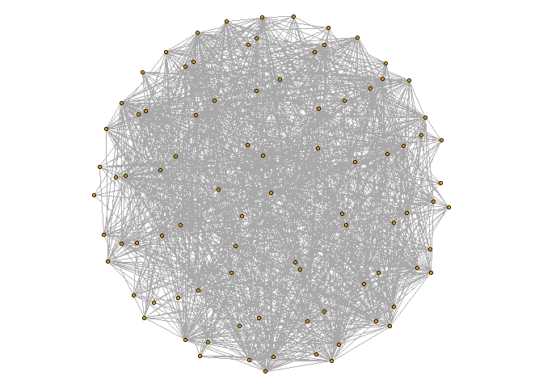
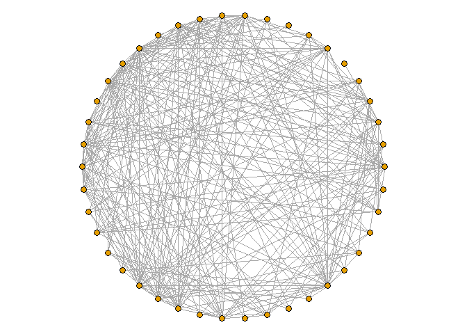

FinalMarkdown
================
Giovani Gutierrez
2024-05-28

# 1

``` r
edgelist <- read_csv('large_twitch_edges.csv', show_col_types = FALSE)

features <- read_csv(
  'large_twitch_features.csv',
  col_types = list(language = col_factor(), mature = col_logical(),
                   dead_account = col_logical(), affiliate = col_logical())
) %>% relocate(numeric_id, .before = views) # move id to first col
```

``` r
edgelist <- matrix(unlist(edgelist), ncol = 2) + 1
features$numeric_id <- features$numeric_id + 1 

g <- graph_from_edgelist(edgelist, directed = FALSE) %>% 
  set_vertex_attr(name = 'views', value = features$views) %>% 
  set_vertex_attr(name = 'mature', value = features$mature) %>% 
  set_vertex_attr(name = 'life_time', value = features$life_time) %>% 
  set_vertex_attr(name = 'dead_account', value = features$dead_account) %>% 
  set_vertex_attr(name = 'language', value = features$language) %>% 
  set_vertex_attr(name = 'affiliate', value = features$affiliate)
```

``` r
V(g)$deg <- degree(g)
```

``` r
vert_2500 <- V(g)[deg >= 2500]
vert_5000 <- V(g)[deg >= 5000]
vert_7500 <- V(g)[deg >= 7500]
vert_10000 <- V(g)[deg >= 10000]
```

``` r
# induced subgraphs based on node degree
sg1 <- induced_subgraph(g, vids = vert_2500)
sg2 <- induced_subgraph(g, vids = vert_5000)
sg3 <- induced_subgraph(g, vids = vert_7500)
sg4 <- induced_subgraph(g, vids = vert_10000)
```

``` r
par(mar = c(0, 0, 0, 0))
plot(sg1, vertex.size = 2.5, vertex.label = NA, layout = layout_on_sphere, edge.width = NA)
```

<!-- -->

``` r
par(mar = c(0, 0, 0, 0))
plot(sg2, vertex.size = 2.5, vertex.label = NA, layout = layout_on_sphere)
```

<!-- -->

``` r
par(mar = c(0, 0, 0, 0))
plot(sg3, vertex.size = 4, vertex.label = NA, layout = layout_in_circle)
```

<!-- -->

``` r
par(mar = c(0, 0, 0, 0))
plot(sg4, vertex.size = 5, vertex.label = NA, layout = layout.circle)
```

<!-- -->
