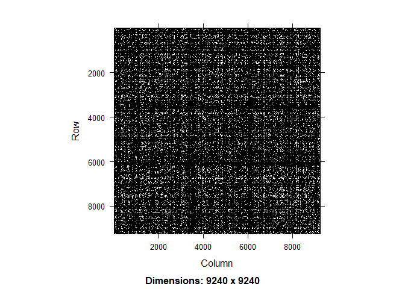
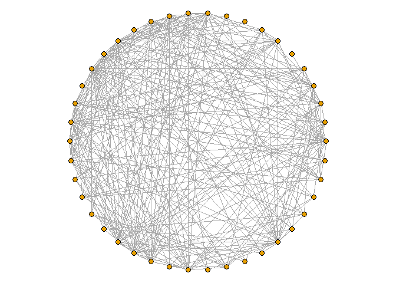
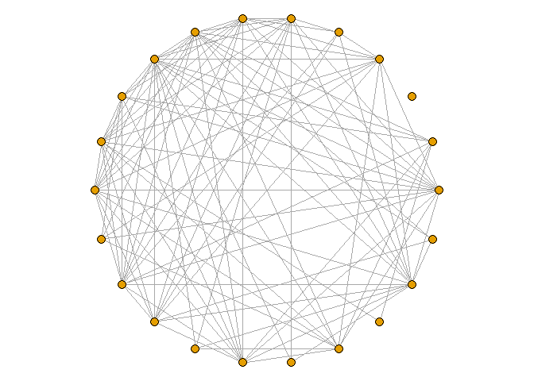

FinalMarkdown
================
Giovani Gutierrez
2024-05-28

# 1

``` r
edgelist <- read_csv('large_twitch_edges.csv')
```

    ## Rows: 6797557 Columns: 2
    ## ── Column specification ────────────────────────────────────────────────────────
    ## Delimiter: ","
    ## dbl (2): Source, Target
    ## 
    ## ℹ Use `spec()` to retrieve the full column specification for this data.
    ## ℹ Specify the column types or set `show_col_types = FALSE` to quiet this message.

``` r
features <- read_csv(
  'large_twitch_features.csv',
  col_types = list(language = col_factor(), mature = col_logical(),
                   dead_account = col_logical(), affiliate = col_logical())
) %>% relocate(numeric_id, .before = views) # move id to first col
```

``` r
edgelist <- matrix(unlist(edgelist), ncol = 2) + 1
features$numeric_id <- features$numeric_id + 1 

g <- graph_from_edgelist(edgelist, directed = FALSE)
```

``` r
mat <- as_adjacency_matrix(g, sparse = TRUE)
```

``` r
g <- g %>% 
  set_vertex_attr(name = 'views', value = features$views) %>% 
  set_vertex_attr(name = 'mature', value = features$mature) %>% 
  set_vertex_attr(name = 'life_time', value = features$life_time) %>% 
  set_vertex_attr(name = 'dead_account', value = features$dead_account) %>% 
  set_vertex_attr(name = 'language', value = features$language) %>% 
  set_vertex_attr(name = 'affiliate', value = features$affiliate)
```

``` r
V(g)$deg <- degree(g)
```

``` r
vert_2500 <- V(g)[deg >= 2500]
vert_5000 <- V(g)[deg >= 5000]
vert_7500 <- V(g)[deg >= 7500]
vert_10000 <- V(g)[deg >= 10000]
```

``` r
# induced subgraphs based on node degree
sg1 <- induced_subgraph(g, vids = vert_2500)
sg2 <- induced_subgraph(g, vids = vert_5000)
sg3 <- induced_subgraph(g, vids = vert_7500)
sg4 <- induced_subgraph(g, vids = vert_10000)
```

``` r
sg1
```

    ## IGRAPH 2b5ae3b U--- 276 6890 -- 
    ## + attr: views (v/n), mature (v/l), life_time (v/n), dead_account (v/l),
    ## | language (v/x), affiliate (v/l), deg (v/n)
    ## + edges from 2b5ae3b:
    ##  [1]  2-- 4  4-- 5  2-- 8  5-- 8  7-- 8  7--10  4--11  5--13  3--14  6--14
    ## [11]  6--16  7--17  2--18  4--18  7--19 10--19 14--19 18--20  4--21  7--21
    ## [21] 11--21 18--21  6--22  8--22  4--23  5--23  8--23  9--23 11--23 12--23
    ## [31] 13--23 14--23 17--23 20--23 21--23 18--24 23--24  4--25  9--25 11--25
    ## [41] 21--25  8--26 12--26 14--26 21--26  7--27 10--27 11--27 13--27 17--27
    ## [51] 21--28  5--29  7--29  8--29 22--29  2--30  4--30 12--30 13--30 14--30
    ## [61] 18--30 23--30 25--31 28--31 30--31  3--32 26--32 27--32 30--32  4--33
    ## + ... omitted several edges

``` r
V(sg1)$deg <- degree(sg1)
```

``` r
par(mar = c(0, 0, 0, 0))
plot(sg1, vertex.size = 2.5, vertex.label = NA, layout = layout_on_sphere, edge.width = NA)
```

<!-- -->

``` r
par(mar = c(0, 0, 0, 0))
plot(sg2, vertex.size = 2.5, vertex.label = NA, layout = layout_on_sphere)
```

<!-- -->

``` r
par(mar = c(0, 0, 0, 0))
plot(sg3, vertex.size = 4, vertex.label = NA, layout = layout_in_circle)
```

<!-- -->

``` r
par(mar = c(0, 0, 0, 0))
plot(sg4, vertex.size = 5, vertex.label = NA, layout = layout.circle)
```

<!-- -->
