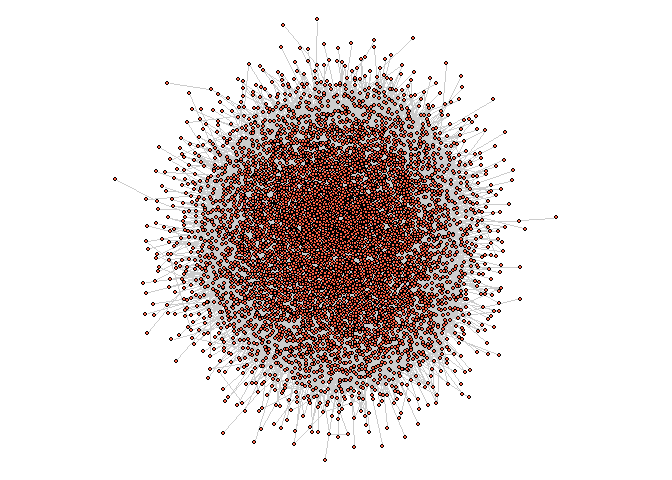
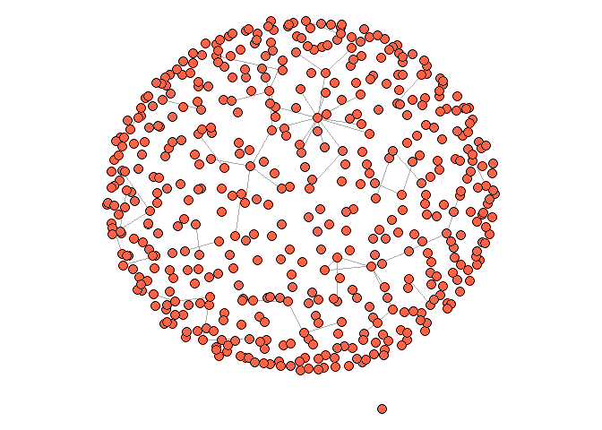

FinalMarkdown
================
Giovani Gutierrez
2024-06-06

# 1

``` r
edgelist <- read_csv('large_twitch_edges.csv', show_col_types = FALSE)

features <- read_csv(
  'large_twitch_features.csv',
  col_types = list(language = col_factor(), mature = col_logical(),
                   dead_account = col_logical(), affiliate = col_logical())
) %>% relocate(numeric_id, .before = views) # move id to first col
```

``` r
edgelist <- matrix(unlist(edgelist), ncol = 2) + 1
features$numeric_id <- features$numeric_id + 1 

g <- graph_from_edgelist(edgelist, directed = FALSE) %>% 
  set_vertex_attr(name = 'views', value = features$views) %>% 
  set_vertex_attr(name = 'mature', value = features$mature) %>% 
  set_vertex_attr(name = 'life_time', value = features$life_time) %>% 
  set_vertex_attr(name = 'dead_account', value = features$dead_account) %>% 
  set_vertex_attr(name = 'language', value = features$language) %>% 
  set_vertex_attr(name = 'affiliate', value = features$affiliate)
```

``` r
summary(features)
```

    ##    numeric_id         views             mature          life_time   
    ##  Min.   :     1   Min.   :        0   Mode :logical   Min.   :  11  
    ##  1st Qu.: 42029   1st Qu.:     1415   FALSE:89081     1st Qu.: 997  
    ##  Median : 84058   Median :     4117   TRUE :79033     Median :1540  
    ##  Mean   : 84058   Mean   :   188162                   Mean   :1542  
    ##  3rd Qu.:126086   3rd Qu.:    14208                   3rd Qu.:2027  
    ##  Max.   :168114   Max.   :384396587                   Max.   :4161  
    ##                                                                     
    ##    created_at           updated_at         dead_account       language     
    ##  Min.   :2007-05-22   Min.   :2013-09-14   Mode :logical   EN     :124411  
    ##  1st Qu.:2013-03-07   1st Qu.:2018-10-04   FALSE:162955    DE     :  9428  
    ##  Median :2014-07-07   Median :2018-10-11   TRUE :5159      FR     :  6799  
    ##  Mean   :2014-07-08   Mean   :2018-09-27                   ES     :  5699  
    ##  3rd Qu.:2016-01-06   3rd Qu.:2018-10-12                   RU     :  4821  
    ##  Max.   :2018-05-13   Max.   :2018-10-13                   ZH     :  2828  
    ##                                                            (Other): 14128  
    ##  affiliate      
    ##  Mode :logical  
    ##  FALSE:86568    
    ##  TRUE :81546    
    ##                 
    ##                 
    ##                 
    ## 

``` r
vert_de <- V(g)[language == 'DE'] # german speaking nodes
g_de <- induced_subgraph(g, vids = vert_de)
comp <- components(g_de)
biggest_cluster_id <- which.max(comp$csize)
vert_ids <- V(g_de)[comp$membership == biggest_cluster_id]
g1 <- induced_subgraph(g_de, vert_ids)
summary(g1)
```

    ## IGRAPH d29d225 U--- 9240 160751 -- 
    ## + attr: views (v/n), mature (v/l), life_time (v/n), dead_account (v/l),
    ## | language (v/x), affiliate (v/l)

``` r
set.seed(123)
par(mar = c(0, 0, 0, 0))

plot(g1, vertex.size = 2, vertex.label = NA, layout = layout_with_fr, vertex.color='#88398A', edge.color = 'gray80', vertex.frame.width=0.1)
```

<!-- -->

``` r
deg <- degree(g1)

hist(deg, breaks = seq(-1,(max(deg)+1), by = 0.5), 
     main = 'Histogram of Node Degree',
     xlab = 'Degree', 
     )
```

<!-- -->

``` r
is_simple(g1)
```

    ## [1] TRUE

``` r
is_connected(g1)
```

    ## [1] TRUE

``` r
edge_density(g1)
```

    ## [1] 0.003766056

``` r
transitivity(g1)
```

    ## [1] 0.04844072

``` r
mean_distance(g1, weights = NA, directed = FALSE, unconnected = FALSE)
```

    ## [1] 2.666214

``` r
diameter(g1, directed = FALSE, unconnected = FALSE)
```

    ## [1] 8

``` r
vert_fr <- V(g)[language == 'FR'] # french speaking nodes
g_fr <- induced_subgraph(g, vids = vert_fr)
comp <- components(g_fr)
biggest_cluster_id <- which.max(comp$csize)
vert_ids <- V(g_fr)[comp$membership == biggest_cluster_id]
g2 <- induced_subgraph(g_fr, vert_ids)
summary(g2)
```

    ## IGRAPH e14d2c2 U--- 6720 123642 -- 
    ## + attr: views (v/n), mature (v/l), life_time (v/n), dead_account (v/l),
    ## | language (v/x), affiliate (v/l)

``` r
set.seed(123)
par(mar = c(0, 0, 0, 0))

plot(g2, vertex.size = 2, vertex.label = NA, layout = layout_with_lgl, vertex.color='tomato', edge.color = 'gray80', vertex.frame.width=0.1)
```

<!-- -->

``` r
adj_mat <- as_adjacency_matrix(g1,sparse = TRUE)
image(Matrix(adj_mat))
```

<!-- -->

``` r
sg1 <- induced_subgraph(g, sample(V(g), 500))
sg2 <- induced_subgraph(g, sample(V(g), 1000))
```

``` r
par(mar=c(0,0,0,0))
plot(sg1, vertex.label = NA, layout = layout_with_kk, vertex.size = 5, vertex.color = 'tomato')
```

<!-- -->

``` r
par(mar=c(0,0,0,0))
plot(sg2, vertex.label = NA, layout = layout_on_sphere, vertex.size = 5, vertex.color = 'tomato')
```

<!-- -->
